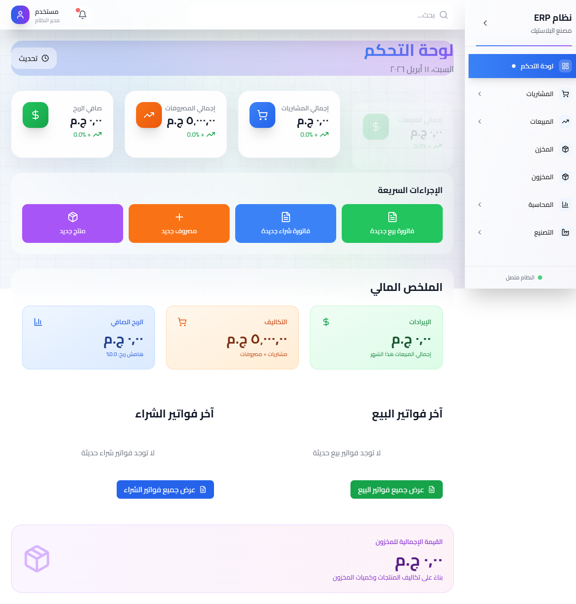
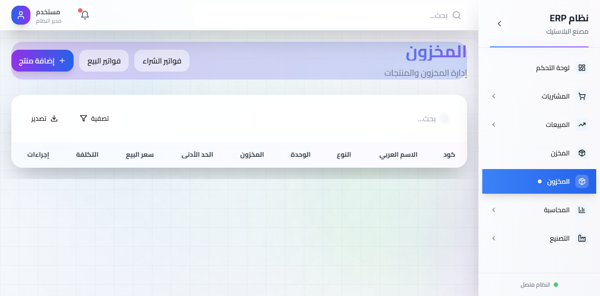
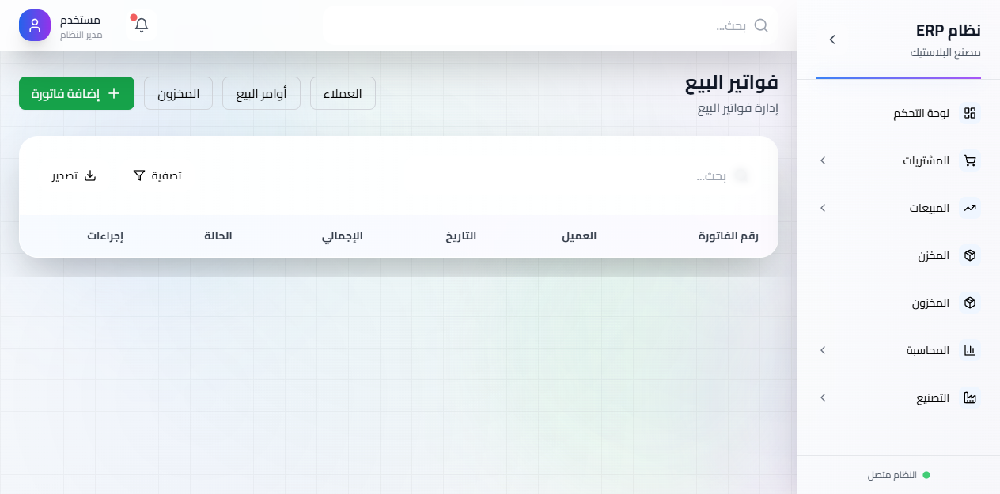
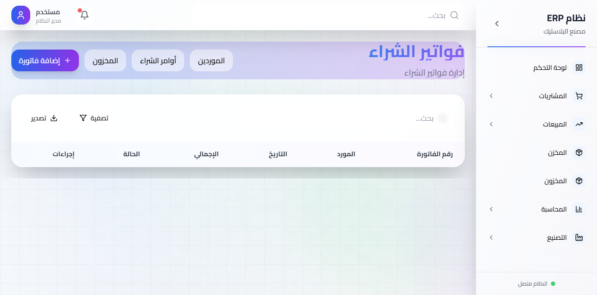
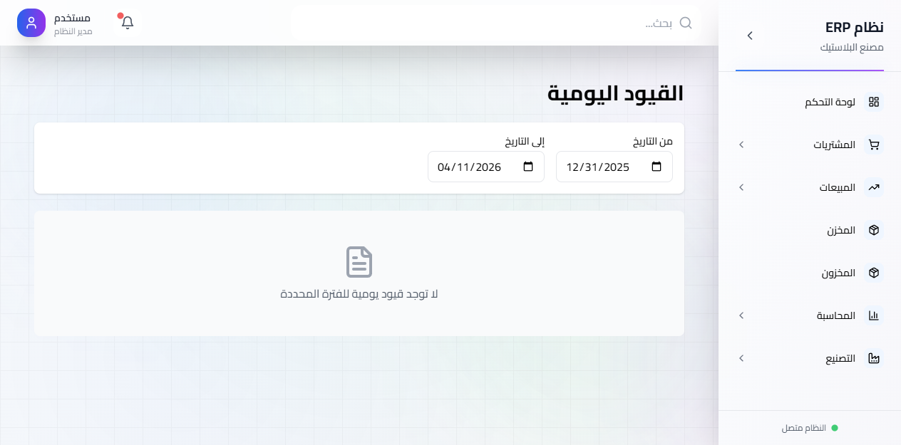

# 🏢 نظام ERP متكامل | Complete ERP System

<div align="center">


**نظام تخطيط موارد المؤسسات احترافي وجاهز للإنتاج**

**Professional Enterprise Resource Planning System - Production Ready**

[🌐 Live Demo](https://erp-system-btoq.onrender.com) | [📖 Documentation](#-documentation) | [🚀 Quick Start](#-quick-start)

</div>

---

## 🎯 نظرة عامة | Overview

نظام ERP متكامل مبني بأحدث التقنيات لإدارة جميع عمليات المؤسسة من المخزون والمبيعات والمشتريات والتصنيع والحسابات.

A fully integrated ERP system built with modern technologies to manage all enterprise operations including inventory, sales, purchases, manufacturing, and accounting.

### ✨ المميزات الرئيسية | Key Features

- 📊 **لوحة تحكم تفاعلية** - مؤشرات أداء فورية وتقارير مالية
- 📦 **إدارة المخزون** - تتبع المنتجات والمخزون بدقة
- 🛒 **إدارة المبيعات** - فواتير وأوامر بيع وإدارة العملاء
- 🏭 **إدارة المشتريات** - فواتير وأوامر شراء وإدارة الموردين
- 🔧 **التصنيع** - أوامر إنتاج مع قوائم المواد (BOM)
- 💰 **المحاسبة** - قيود يومية، قوائم دخل، ميزانيات عمومية
- 📈 **التقارير** - تقارير مالية فورية ومتقدمة

---

## 🌐 التجربة المباشرة | Live Demo

**🔗 [erp-system-btoq.onrender.com](https://erp-system-btoq.onrender.com)**

> النظام متاح للتجربة مباشرة بدون تسجيل دخول
> 
> System available for immediate testing without login

### What's Included
- 📊 **Dashboard** - Real-time KPIs and financial summary
- 📦 **Inventory Management** - Product management with stock tracking
- 🛒 **Sales Module** - Invoices, orders, and customer management
- 🏭 **Purchase Module** - Invoices, orders, and supplier management
- 🔧 **Manufacturing** - Production orders with Bill of Materials (BOM)
- 💰 **Accounting** - Double-entry GL, P&L statements, balance sheets
- 📈 **Reports** - Real-time financial reports and analytics

---

## 🚀 البدء السريع | Quick Start

### 📋 المتطلبات | Prerequisites
- Node.js >= 18.0
- npm >= 8.0
- PostgreSQL (للإنتاج | for production)

### 💻 التثبيت المحلي | Local Installation

```bash
# استنساخ المشروع | Clone the repository
git clone https://github.com/3bud-ZC/erp-system.git
cd erp-system

# تثبيت المكتبات | Install dependencies
npm install

# إعداد قاعدة البيانات | Setup database
npx prisma generate
npx prisma migrate deploy
npx prisma db seed

# تشغيل السيرفر | Start development server
npm run dev
```

افتح [http://localhost:3000](http://localhost:3000) في المتصفح

Open [http://localhost:3000](http://localhost:3000) in your browser

### 🌐 النشر على Render | Deploy to Render

```bash
# 1. Push to GitHub
git push origin master

# 2. Connect to Render
# - Go to https://dashboard.render.com
# - Create new Web Service
# - Connect GitHub repository

# 3. Environment Variables
DATABASE_URL=postgresql://...
JWT_SECRET=your-secret-key
NEXTAUTH_SECRET=your-nextauth-secret
NEXTAUTH_URL=https://your-app.onrender.com
NODE_ENV=production

# 4. Build & Start Commands
Build: npm ci && npx prisma generate && npx prisma migrate deploy && npx prisma db seed && npm run build
Start: npm start
```

---

## 📋 Core Features

### ✅ Inventory Management
- Real-time stock tracking with movement audit trail
- Automatic stock validation before operations
- Prevents negative stock at database level
- Multi-location inventory (foundation ready)

### ✅ Sales Operations
- Sales order and invoice creation
- Automatic stock deduction upon sale
- Customer relationship tracking
- Real-time sales analytics

### ✅ Purchase Management
- Purchase order and invoice creation
- Automatic stock increase upon purchase
- Supplier management and tracking
- Purchase analytics and reporting

### ✅ Manufacturing System
- Bill of Materials (BOM) definition
- Production order creation with BOM explosion
- Raw material validation and deduction
- Work-in-Progress (WIP) cost tracking
- Finished goods automatic creation

### ✅ Accounting Integration
- Double-entry bookkeeping (all entries balance)
- Automatic GL posting on all transactions
- 18-account chart of accounts
- Profit & Loss statement (real-time)
- Balance Sheet (point-in-time)
- Cash Flow analysis

### ✅ Quality Features
- Full form validation
- Comprehensive error handling
- Loading states on all async operations
- Arabic localization with RTL support
- Responsive design (mobile-friendly)

---

## 📸 لقطات الشاشة | Screenshots

### لوحة التحكم | Dashboard


### المخزون | Inventory


### المبيعات | Sales


### المشتريات | Purchases


### المحاسبة | Accounting


---

## 🏗️ البنية التقنية | Architecture

### 🛠️ التقنيات المستخدمة | Tech Stack

| Layer | Technology |
|-------|------------|
| **Frontend** | Next.js 14.2, React 18, TypeScript 5.0 |
| **Styling** | TailwindCSS 3.4, Lucide Icons |
| **Backend** | Next.js API Routes, Node.js 18+ |
| **Database** | PostgreSQL (Production), Prisma ORM |
| **Deployment** | Render.com (Free Tier) |
| **Language** | Arabic/English (RTL Support) |

### Project Structure
```
app/(dashboard)/          # Protected UI routes (34 pages)
├── inventory/           # Product management
├── sales/               # Invoices, orders, customers, reports
├── purchases/           # Invoices, orders, suppliers, expenses, reports
├── manufacturing/       # Production orders, BOM, cost study
└── accounting/          # Financial summary, journal, P&L

app/api/                 # REST API routes (12 endpoints, 34+ operations)
├── products/            # CRUD for products
├── sales-invoices/      # Sales with auto GL posting
├── purchase-invoices/   # Purchases with auto GL posting
├── expenses/            # Expenses with auto GL posting
├── production-orders/   # Manufacturing with BOM
├── bom/                 # Bill of Materials
└── reports/             # Financial reports (real-time)

lib/
├── db.ts               # Prisma client
├── accounting.ts       # GL posting engine
└── inventory.ts        # Stock validation

prisma/
├── schema.prisma       # Database schema (14 models)
└── dev.db             # SQLite database
```

---

## 📊 Database Schema

### 14 Data Models
1. **Product** - Inventory items
2. **Supplier** - Vendor information
3. **Customer** - Customer data
4. **StockMovement** ⭐ - Audit trail
5. **WorkInProgress** ⭐ - Manufacturing costs
6. **InventoryValuation** ⭐ - Product costing
7. **SalesInvoice** - Sales transactions
8. **SalesInvoiceItem** - Sales line items
9. **SalesOrder** - Sales orders
10. **PurchaseInvoice** - Purchase transactions
11. **PurchaseInvoiceItem** - Purchase line items
12. **ProductionOrder** ⭐ - Manufacturing orders
13. **BOMItem** ⭐ - Bill of Materials
14. **Expense** - Expense tracking

See `prisma/schema.prisma` for the complete relational schema.

---

## 🔌 واجهات برمجية | API Endpoints

### REST API متكامل | Complete REST API

جميع الـ APIs تستخدم صيغة موحدة للاستجابة:

All APIs use standardized response format:

```typescript
// Success Response
{
  success: true,
  data: {...},
  message: "Operation successful"
}

// Error Response
{
  success: false,
  message: "Error description",
  code: 400
}
```

| Endpoint | Methods | الوصف | Description |
|----------|---------|--------|-------------|
| `/api/products` | GET/POST/PUT/DELETE | إدارة المنتجات | Product management |
| `/api/customers` | GET/POST/PUT/DELETE | إدارة العملاء | Customer management |
| `/api/suppliers` | GET/POST/PUT/DELETE | إدارة الموردين | Supplier management |
| `/api/warehouses` | GET/POST/PUT/DELETE | إدارة المخازن | Warehouse management |
| `/api/sales-invoices` | GET/POST/PUT/DELETE | فواتير البيع + قيود محاسبية | Sales with auto GL |
| `/api/purchase-invoices` | GET/POST/PUT/DELETE | فواتير الشراء + قيود محاسبية | Purchases with auto GL |
| `/api/sales-orders` | GET/POST/PUT/DELETE | أوامر البيع | Sales orders |
| `/api/purchase-orders` | GET/POST/PUT/DELETE | أوامر الشراء | Purchase orders |
| `/api/expenses` | GET/POST/PUT/DELETE | المصروفات + قيود محاسبية | Expenses with auto GL |
| `/api/production-orders` | GET/POST/PUT/DELETE | أوامر الإنتاج + BOM | Manufacturing with BOM |
| `/api/bom` | GET/POST/PUT/DELETE | قوائم المواد | Bill of Materials |
| `/api/journal-entries` | GET/POST/PUT/DELETE | القيود اليومية | Journal entries |
| `/api/reports` | GET | التقارير المالية | Financial reports |
| `/api/dashboard` | GET | لوحة التحكم | Dashboard KPIs |

---

## ⚙️ Business Logic

### Automatic Stock Management
```
When Purchase Invoice Created:
  1. Save invoice
  2. Increment product stock
  3. Record stock movement
  4. Auto-post GL: DR Inventory / CR Accounts Payable

When Sales Invoice Created:
  1. Validate stock available
  2. If yes: Save invoice, decrement stock, record movement
  3. Auto-post GL: DR AR / CR Revenue + DR COGS / CR Inventory
  4. If no: Show error, prevent operation
```

### Manufacturing Workflow
```
1. Define BOM (e.g., Product A = 2x Material B + 3x Material C)
2. Create Production Order (Produce 10 units of A)
3. System calculates: Need 20x B + 30x C
4. Validate stock available
5. If yes: Decrement B&C, create WIP record
6. On completion: Add A to inventory, post GL entries
7. If no: Show error with details
```

---

## 🧪 Testing

### Full Workflow (Copy & Paste)
```bash
# 1. Add product to Inventory
# Navigate to http://localhost:3000/inventory
# Add "Coffee" (100 units, $50/unit)

# 2. Add supplier
# Navigate to http://localhost:3000/purchases/suppliers
# Add "Brazil Coffee Co"

# 3. Create purchase
# Navigate to http://localhost:3000/purchases/invoices
# Buy 100 units from supplier
# Verify: Stock becomes 100

# 4. Add customer
# Navigate to http://localhost:3000/sales/customers
# Add "Cafe Downtown"

# 5. Create sales
# Navigate to http://localhost:3000/sales/invoices
# Sell 30 units to customer
# Verify: Stock decreases to 70

# 6. Check accounting
# Navigate to http://localhost:3000/accounting
# Verify P&L and Balance Sheet
```

---

## 📈 Reports (Real-time from GL)

All reports are calculated from actual transactions:
- **Profit & Loss** - Revenue, COGS, expenses, net income
- **Balance Sheet** - Assets, liabilities, equity (must balance)
- **Cash Flow** - Operating, investing, financing activities
- **Inventory Valuation** - Product costs and totals

---

## 🚀 Deployment

### Vercel (Recommended)
```bash
npm install -g vercel
vercel
# Set DATABASE_URL in dashboard
```

### Traditional Server
```bash
npm run build
npm start
# Use PM2 for process management
```

### PostgreSQL Upgrade
```bash
# Update .env: DATABASE_URL="postgresql://..."
npx prisma migrate deploy
```

---

## 📚 Documentation

- **[HANDOFF_DOCUMENT.md](./HANDOFF_DOCUMENT.md)** - Complete technical guide (914 lines)
- **[ERP_COMPLETION_REPORT.md](./ERP_COMPLETION_REPORT.md)** - Implementation details
- **[DEMO_READY.md](./DEMO_READY.md)** - Demo setup
- **[prisma/schema.prisma](./prisma/schema.prisma)** - Database schema

---

## 🔒 Security

### Current ✅
- Input validation
- Type safety (TypeScript)
- Database transaction safety
- Stock validation

### For Production ⚠️
- Add authentication
- Add authorization (RBAC)
- Enable HTTPS/SSL
- Add rate limiting
- Add audit logging

---

## 🛠️ Development

```bash
npm run dev       # Start dev server
npm run build     # Build for production
npm start         # Start production server
npx tsc --noEmit  # Type check
npx prisma studio # Open database UI
```

---

## 🤝 المساهمة | Contributing

نرحب بجميع المساهمات! | We welcome all contributions!

```bash
# 1. Fork the repository
# 2. Create your feature branch
git checkout -b feature/AmazingFeature

# 3. Commit your changes
git commit -m 'Add some AmazingFeature'

# 4. Push to the branch
git push origin feature/AmazingFeature

# 5. Open a Pull Request
```

---

## 📞 الدعم | Support

- 📧 Email: support@erp-system.com
- 🐛 Issues: [GitHub Issues](https://github.com/3bud-ZC/erp-system/issues)
- 📖 Docs: [Documentation](#-documentation)

---

## 📄 الترخيص | License

MIT License - مفتوح المصدر ومجاني للاستخدام

MIT License - Open source and free to use

---

## 🎯 الملخص | Summary

<div align="center">

### ✅ جاهز للإنتاج | Production-Ready

**نظام ERP متكامل من الصفر**

**Complete ERP System from Scratch**

✅ **متكامل بالكامل** - 34 صفحة + 34 API  
✅ **بيانات حقيقية** - لا توجد بيانات وهمية  
✅ **مميزات احترافية** - محاسبة، تصنيع، تقارير  
✅ **جودة عالية** - TypeScript، Validation، Error Handling  
✅ **قابل للتوسع** - من SQLite إلى PostgreSQL  

---

### 🚀 ابدأ الآن | Get Started

```bash
npm install && npm run dev
```

**🌐 [جرب النظام مباشرة | Try Live Demo](https://erp-system-btoq.onrender.com)**

---

**جاهز للاستخدام. جاهز للتوسع. جاهز للإنتاج.**

**Ready to use. Ready to scale. Ready for production.**

</div>

---

<div align="center">

Made with ❤️ by [3bud-ZC](https://github.com/3bud-ZC)

⭐ إذا أعجبك المشروع، لا تنسى النجمة! | If you like this project, don't forget to star it!

</div>
